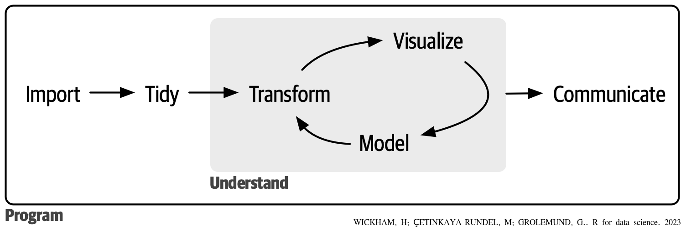
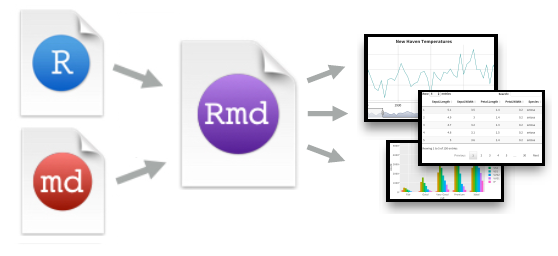

---
output:
  rmdformats::robobook:
    self_contained: true
    thumbnails: true
    lightbox: true
    gallery: true
    highlight: kate
    use_bookdown: true
    css: "../css/basic.css"
---

```{r  include=FALSE}
make_path=function(file,path="/home/cassio/Programas_em_R/curso_FGV/images/"){
  paste0(path,file)
}

knitr::opts_chunk$set(echo =TRUE, warning=FALSE)
library(tidyverse)
```


# Introdução

A ciência de dados é uma área que estuda como extrair conhecimento dos dados. Um campo vasto, que utiliza técnicas e teorias de diversas áreas, tais como: Banco de Dados, Estatística, Machine Learning, Visualização de dados, Computação(e Programação) e experiencia no domínio do problema.

Tudo começa com uma análise detalhada do problema para definir as hipóteses ou perguntas a serem respondidas, entender quais dados serão necessários e como ou onde obte-los. Nesta etapa e nas discussões a cada ciclo, é fundamental a integração de especialista da área (contexto) do problema e os cientistas de dados.Na sequencia, inicia-se a fase de análise dos dados. A figura abaixo mostra um modelo típico de analise de dados em um projeto de ciência de dados, que inclui diversas fase e ciclos que necessitam de uma diversidade de conhecimentos e habilidades.

```{r}

```


1. **Importação e Organização dos Dados:**
   - Importação inicial dos dados para o ambiente de trabalho (o R) é crucial para iniciar a análise de dados.
   - Organização dos dados (tidying) é um etapa fundamental e geralmente a de maior esforço. Tem grande importância para garantir consistência, onde cada coluna representa uma variável e cada linha uma observação.

2. **Transformação e Processamento dos Dados:**
   - Transformação envolve focar em observações específicas, criar novas variáveis e calcular estatísticas resumidas.
   - Tidying e transformação, chamados de *"wrangling"*, são essenciais para facilitar a análise dos dados.

3. **Visualização e Modelagem:**
   - Visualização é uma etapa importante na busca de entendimento de padrões  e relações nos dados.
   - Modelos, são ferramentas estatísticas ou computacionais com finalidades específicas para execuções de tarefas e tomada de decisões.

4. **Comunicação:**
   - Comunicar os resultados é crucial, independentemente da qualidade das visualizações e modelos.
   
5. **Programação:**
   - A programação é uma ferramenta abrangente usada em todas as fases do projeto de ciência de dados, permitindo automação e resolução eficiente de problemas.
   - Embora essas ferramentas extremamente úteis e capazes de resolver praticamente todos os problemas, muitas vezes é conveniente a utilização de outras conforme o andamento do projeto.


## Uso do R

**Packages:**

- RMarkdown
- Knitr


## O RMarkdown

- Ambiente para criação de documentos de forma dinâmica - Integra código R e texto 
- Executa o código R na geração do documento
- Documentos reproduzíveis (*reproducible research*)
- Uma implementação de *Markdown*


## *package*

- package "rmarkdown"
- O arquivo rmarkdown é um arquivo texto com extenxsão *.Rmd*.

## Arquivo *.Rmd*

```{r, out.width = "70%",fig.cap= ""}

```

- O arquivo *.Rmd* comtém todo os registros
- O conteúdo pode ser reexecutado 


## Geração de Documentos

```{r, out.width = "60%",fig.cap= "from:rmarkdown-cheatsheet-2.0"}
knitr::include_graphics("figures/RMarkdownOutputFormats.png")
```


## Sequencia para Geração de Documento - "Rendering"

1. Criação de um arquivo *.Rmd*  que inclui codigo *R* e texto (*markdown*) 
1. o *knitr* executa o código R e converte o arquivo *.Rmd* criando um arquivo *.md*.
      - Knitr é um *package* do R que permite a integração do do código R em um documento RMarkdown em um arquivo markdown
1. O arquivo *.md* é usado pelo *pandoc*, que irá criar o documento final(ex. html, Microsoft word, pdf, etc.).
    - *Pandoc* é um conversor universal de documentos para vários formatos (no caso, de *.Rmd* para *HTML*)


```{r, out.width = "90%",fig.cap= "from:rmarkdown-cheatsheet-2.0"}
knitr::include_graphics("figures/RMarkdownFlow.png")
```


## Formatos de Saída

- Documentos e *Slides* em:
    - html
    - pdf
    - word
- Outros: Livros, websites e Documentos Interativos


## Vantagens

- Texto e códigos em um só lugar em uma ordem lógica, no fluxo da análise de dados
- Os resultados são automaticamente atualizados com uma alteração nos dados ou código
- Uma versão do documento sempre pronta para apresentação e discussão 


## Boas Práticas

- Mantenha todos os arquivos sob uma mesma *pasta/diretório* (**relative paths**)
- Não altere o diretório de trabalho (**setwd()**)
- Compile os documentos em uma sessão limpa (**enviroment**)
- Evite comando com interação humana (**file.choice()**)
- Agregue informações sobre a sessão do R (**sessionInfo()**) 


## Referências

- **XIE, Yihui.** *Dynamic Documents With R and knitr*. 
- **PENG, Roger**. *Report Writing for Data Science in R*
- **GANDRUD,Christopher**.  *Reproducible Research with R and RStudio*
- **MOUNT, John; ZUMEL, Nina**. *Practical data science with R*. 2019.
- **WICKHAM, Hadley; ÇETINKAYA-RUNDEL, Mine; GROLEMUND, Garrett**. *R for data science*. 2023. 
